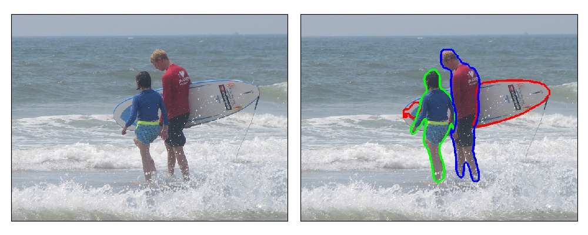

# 画像中の重要領域に関するアンケート

## 準備

このプログラムはpython3で動きます．

まず，以下のコマンドでこのリポジトリをダウンロードしてください．

```$ git clone https://github.com/suzu-taku/questionnaire.git```

次に，以下のコマンドでパッケージ（OpenCV, matplotlib）をインストールしてください．

```$ pip install -r requirements.txt```

## 実行

準備ができたら，"main.py"を実行してください．

```$ python main.py```

実行すると，まず以下の画面が表示されます．




最後まで終了したら[ここ](https://www.dropbox.com/request/dqUKYzZdGBerNj2a7zgu)に"result.txt"を送信してください．
